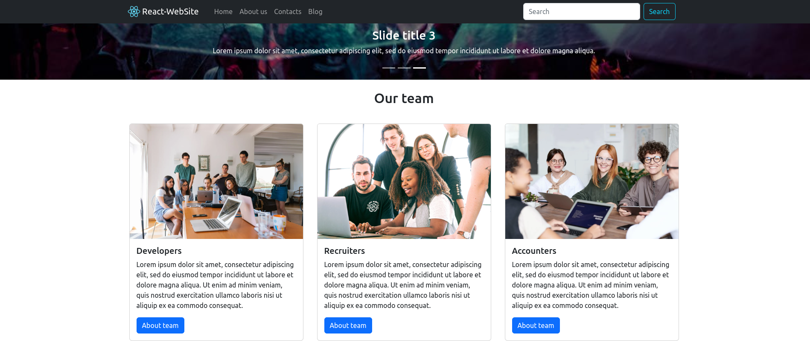
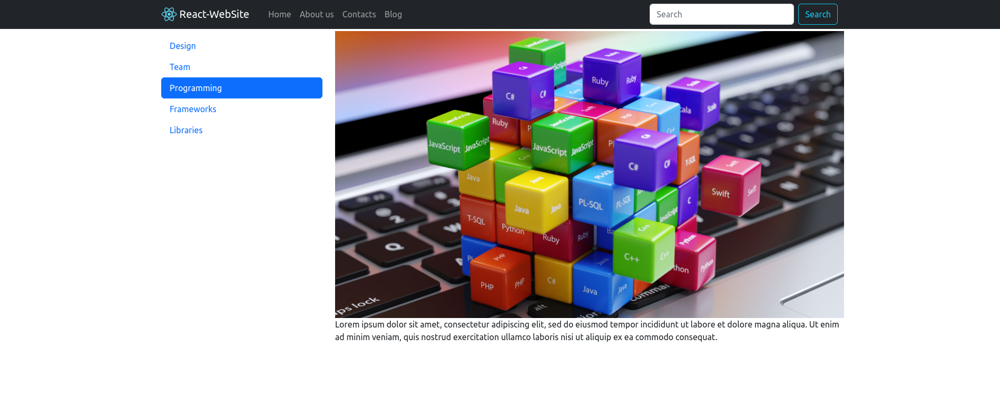
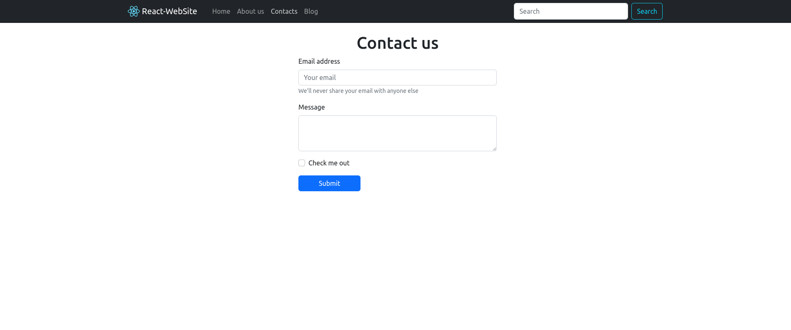
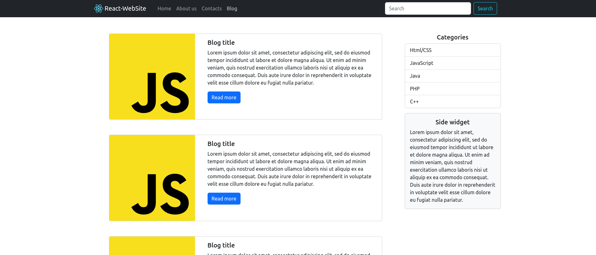
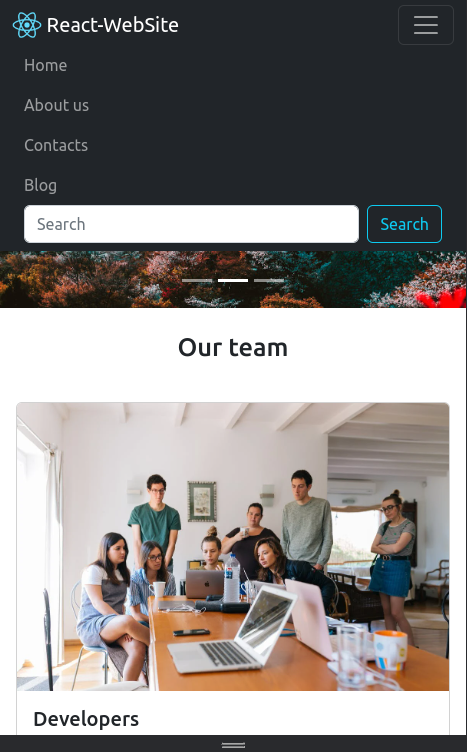

# Simple-Website-v1
Built with React and Bootstrap

## Installation for Developers

Create React-App 
```
npx create-react-app simple-website-v1
```
Install Bootstrap
```
npm i react-bootstrap bootstrap
```
Install React-Router-Dom
```
npm i react-router-dom@6
```

## Usage for Developers

Install package dependencies
```
npm install
```

## Project background

- Home Page


- About Page


- Contacts Page


- Blog Page


- Responsive Interface
